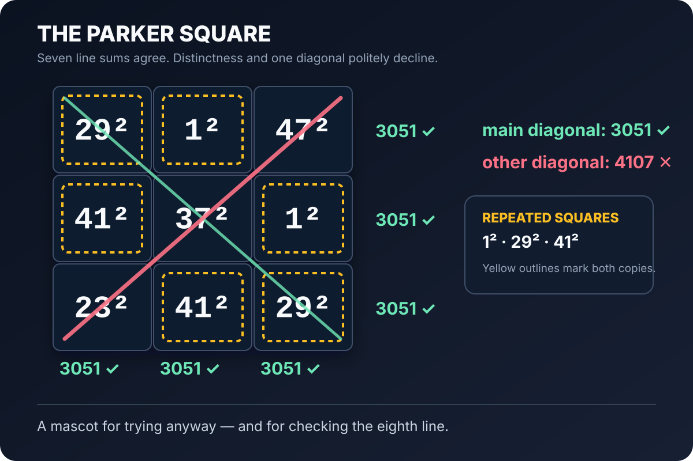

# Magic Squares of Squares

This repository collects research notes, proof attempts, exact computations,
and reproducible searches concerning the classical open problem:

> Does there exist a `3 x 3` magic square whose nine entries are pairwise
> distinct positive integer squares?

> [!IMPORTANT]
> **This is an AI-generated mathematical research project, not a human-authored
> proof.** AI systems generated most of the conjectures, proof strategies,
> algebra, code, and exposition under human direction. Uwe Schwarz contributed
> the problem choice, prompts, computing resources, coordination, and review;
> he does not claim authorship of the mathematical results. Nothing here has
> been peer reviewed.



*The actual Parker Square: all six rows and columns and one diagonal sum to
`3051`; the other diagonal sums to `4107`, and three entries are repeated.
Almost magic is still a respectable distance from magic.*

The repository is deliberately broader than its first result. Future work on
constructions, obstructions, geometric reformulations, and computational
searches can live here without changing the project identity.

## Current results

The first research package studies the prime support of the square root of the
center entry. Its main conclusions are:

- the center root of a primitive square cannot be supported on exactly two
  rational primes, with arbitrary positive exponents;
- a center root supported on exactly three prime-power blocks is impossible
  when every local Gaussian index is balanced or extreme; in particular,
  no squarefree center root `p q r` is possible;
- for the first unresolved exponent pattern `p^2 q r`, exact physical
  classification produces 134 weighted switching classes, of which 118 are
  excluded by the proved arithmetic filters and 16 remain necessary cases;
- several bounded exact searches found no local `111` or `211` relation, but
  these searches are evidence only and are not used as global proofs.

These statements do **not** prove that the full magic-square problem has no
solution. The general intermediate-index case remains open, and none of the
16 surviving `p^2 q r` signatures is asserted to be realizable.

## Start here

- [Research report](paper/prime-support-restrictions.pdf) - a compact account
  of the problem, results, proof architecture, computations, and open boundary.
- [LaTeX source](paper/prime-support-restrictions.tex) - source for the report.
- [Prime-support proof archive](research/prime-support/README.md) - detailed
  derivations, classification notes, scanners, and tests.
- [Literature and claim audit](research/prime-support/literature-audit.md) - a
  bounded source review and explicit novelty caveats.
- [UnsolvedMath problem NT-036](https://www.unsolvedmath.com/problems/NT-036)
  - a public discussion page for the original open problem.
- [Raw UnsolvedMath comment](UNSOLVEDMATH-COMMENT.txt) - copy/paste source with
  unrendered LaTeX and an explicit AI-generation disclosure.

## Reproduce the checks

Requirements:

- Python 3.11 or newer;
- a C++20 compiler (`clang++` or `g++`);
- [Tectonic](https://tectonic-typesetting.github.io/) to rebuild the PDF.

Run the full regression suite:

```sh
make test
```

Rebuild the paper:

```sh
make paper
```

The test suite checks the exact finite classifications against independent
enumerators, validates the monomial-filter counts stage by stage, compiles the
C++ scanners, and compares bounded scanner output with direct reference
implementations. Search bounds and zero counts are documented next to the
corresponding source files.

## Review status

This is a public AI-generated working research archive, not a peer-reviewed
publication. Repeated symbolic, computational, and adversarial AI review is
useful for finding mistakes but is not independent mathematical verification.
The literature search is intentionally described as bounded: absence from the
checked sources is not a priority or novelty proof.

The detailed algebra and executable checks are public so that the claims can
be audited rather than accepted on authority. Independent mathematicians
should treat every theorem here as unverified until they have checked it.

## Contributing

Corrections are especially welcome. Please identify the exact lemma, equation,
classification stage, or test involved and provide a counterexample or a
reproducible derivation where possible. See [CONTRIBUTING.md](CONTRIBUTING.md).

## License

- Source code is licensed under the [MIT License](LICENSE).
- The paper, research notes, README files, and artwork are licensed under
  [Creative Commons Attribution 4.0 International](LICENSE-CONTENT).

Attribution may name the **Magic Squares of Squares project** and link to this
repository; it does not need to attribute mathematical authorship to the human
contributor.
